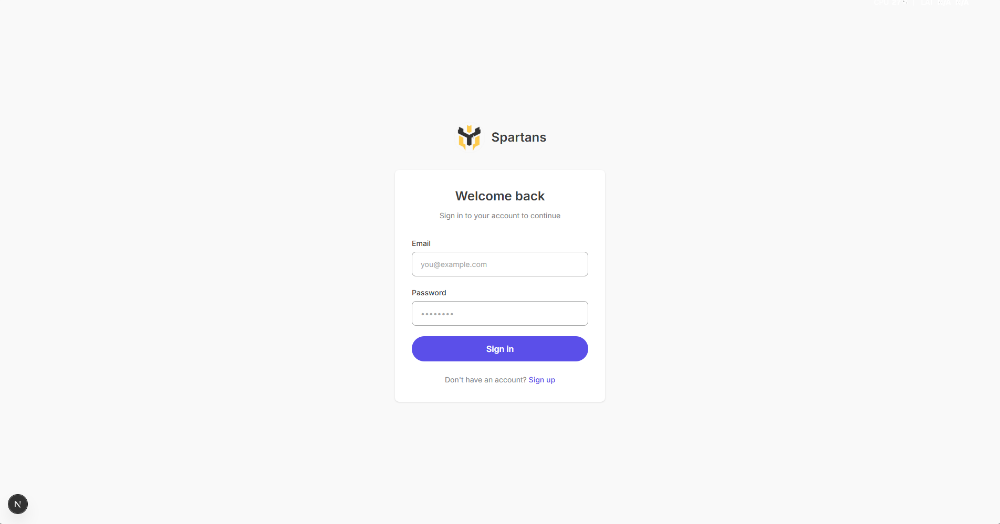
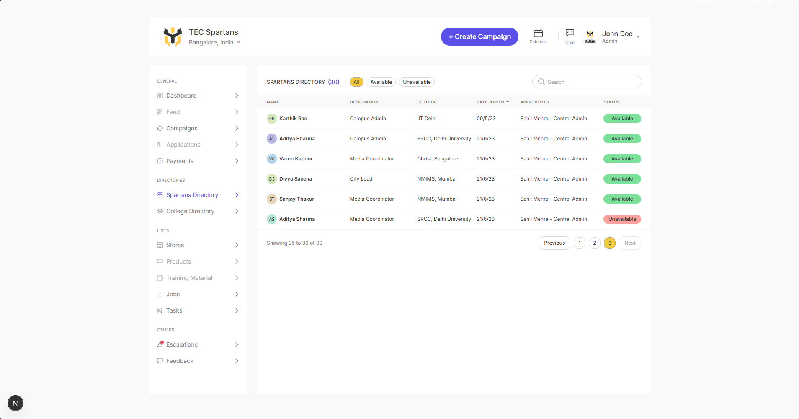
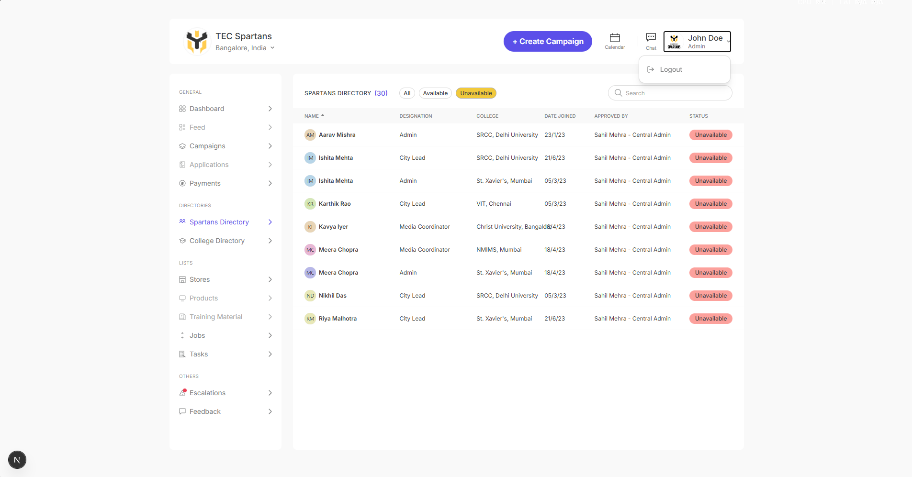

# Spartan Directory

A modern frontend application for managing and viewing the TEC Spartans directory.

## Tech Stack

- **Framework**: Next.js 16 (App Router)
- **Language**: TypeScript
- **Styling**: Tailwind CSS
- **Data Fetching**: TanStack Query (React Query)
- **Testing**: Jest + React Testing Library

## Features

- **Authentication**: Login/signup with client-side auth context
- **Spartans Directory**: View, search, and filter team members
- **Search**: Real-time filtering by name, designation, or college
- **Filter Chips**: Filter by availability status (All / Available / Unavailable)
- **Column Sorting**: Click any column header to sort (ascending → descending → unsorted)
  - Sortable columns: Name, Designation, College, Date Joined, Approved By, Status
  - Visual indicators (↑/↓) show active sort direction
- **Pagination**: Navigate through paginated results
- **Responsive Layout**: Optimized for desktop, tablet, and mobile viewing

## Screenshots

### Login Page


The login page features a clean, centered design with the TEC Spartans logo and authentication form.

### SignUp Page


The sign up page is clean, similar to login with proper input validation.

### Dashboard


The main dashboard displays the Spartans Directory with a sidebar navigation, header, and data table with search, filter, and column sorting capabilities.

### Filter Applied


Example of the directory page with the "Unavailable" filter applied, showing only unavailable spartans.

## Getting Started

### Prerequisites

- Node.js 18+
- npm

### Installation

```bash
npm install
```

### Development

```bash
npm run dev
```

Open [http://localhost:3000](http://localhost:3000) in your browser.

### Testing

```bash
npm test
```

### Build

```bash
npm run build
```

### Linting

```bash
npm run lint
```

### Formatting

```bash
npm run format          # Format code
npm run format:check    # Check formatting without making changes
```

## Deployment

This application can be deployed to various platforms. Here are some recommended options:

### Vercel (Recommended)

1. Push your code to GitHub
2. Import your repository on [Vercel](https://vercel.com)
3. Vercel will automatically detect Next.js and configure the build settings
4. Deploy with one click

**Live Demo**: [View Live Application](https://your-app.vercel.app)

### Environment Variables

No environment variables are required for this application as it uses client-side authentication and mock data.

## Project Structure

```
src/
├── app/                    # Next.js App Router pages
│   ├── (auth)/            # Auth routes (login, signup)
│   ├── (dashboard)/       # Protected dashboard routes
│   └── layout.tsx         # Root layout with providers
├── components/            # Reusable UI components
├── context/               # React context (AuthContext)
├── data/                  # Mock data (spartans)
├── hooks/                 # Custom hooks (useSpartans)
├── providers/             # Provider components (QueryProvider)
├── types/                 # TypeScript type definitions
└── __tests__/             # Test files
```

## Available Scripts

| Script | Description |
|--------|-------------|
| `npm run dev` | Start development server |
| `npm run build` | Create production build |
| `npm run start` | Start production server |
| `npm run lint` | Run ESLint |
| `npm run format:check` | Check code formatting (Prettier) |
| `npm test` | Run tests |
| `npm run format` | Format code with Prettier |

## License

MIT
